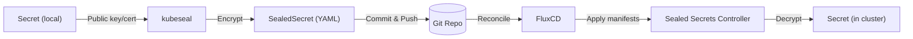

# Sealed Secrets

Sealed Secrets keeps plaintext out of Git by encrypting Kubernetes `Secret` manifests before commit. Flux applies the encrypted `SealedSecret` objects, and the controller decrypts them inside the cluster.

## Flow with FluxCD



- Start with a local `Secret`, encrypt with `kubeseal` and the controller public cert, commit the `SealedSecret`.  
- Flux reconciles and applies it; the controller decrypts to a real `Secret` in the target namespace.

## Install kubeseal

Pin the client version used to encrypt secrets.

```bash
KUBESEAL_VERSION='0.33.1'
curl -OL "https://github.com/bitnami-labs/sealed-secrets/releases/download/v${KUBESEAL_VERSION:?}/kubeseal-${KUBESEAL_VERSION:?}-linux-amd64.tar.gz"
tar -xvzf kubeseal-${KUBESEAL_VERSION:?}-linux-amd64.tar.gz kubeseal
sudo install -m 755 kubeseal /usr/local/bin/kubeseal
kubeseal --version
```

## Retrieve the public cert

Use the active sealing key to seal secrets offline or in CI.

```bash
kubectl get secret -n sealed-secrets
kubectl get secret -n sealed-secrets -l sealedsecrets.bitnami.com/sealed-secrets-key=active -o yaml
kubectl get secret -n sealed-secrets -l sealedsecrets.bitnami.com/sealed-secrets-key=active -o yaml | yq '.items.[0].data."tls.crt"' | base64 -d | openssl x509 -text
kubectl get secret -n sealed-secrets -l sealedsecrets.bitnami.com/sealed-secrets-key=active -o yaml | yq '.items.[0].data."tls.crt"' | base64 -d > tls.crt
```

## Seal a secret

- Create or render a plaintext `Secret` locally (do not commit it).  
- Seal it using the controller cert: `kubeseal --cert tls.crt --controller-namespace sealed-secrets --controller-name sealed-secrets --format yaml > <sealed-secret>.yaml`.  
- See `../demo-app1/README.md` for the demo DB secret example.

## Offline recovery/decryption

If you have the backup private key you can recover a sealed secret without cluster access.

```bash
kubeseal --recovery-unseal \
  --controller-namespace sealed-secrets \
  --controller-name sealed-secrets \
  --recovery-private-key tls.key \
  < demo-db-encrypted.yaml -o yaml
```

`tls.key` must be the controller’s private key; the output is the original plaintext `Secret`.

## Best practices

- Never commit plaintext secrets to Git.
- Use the downloaded public cert (`tls.crt`) for local and CI/CD sealing.
- Treat the controller private key as highly sensitive; rotate keys and reseal secrets as needed.
